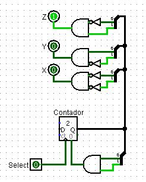
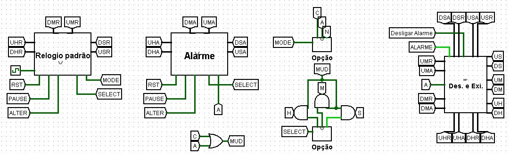

# Simulador de relógio
## Circuito Sequencial e Combinacional
Este projeto consiste em implementar o circuito de um relógio utilizando o simulador
logisim

## Especificações
- O relógio deve possuir CINCO botões: SELECT, PAUSE, MODE, ALTER e RESET.
    - O botão MODE serve para alternar entre os modos do relógio: NORMAL (N),
ALARME (A), MUDANÇA (C).
- Os LEDs C, A e N indicam o modo no qual o relógio se encontra, sendo eles MUDANÇA, ALARME e NORMAL, respectivamente.
   - No modo NORMAL o relógio apenas mostra as horas.
   - No modo ALARME é possível configurar o relógio para alarmar em uma determinada hora.
   - No modo MUDANÇA é possível modificar o horário do relógio.
- Nos modos MUDANÇA e ALARME, o botão SELECT pode ser utilizado para alternar entre os displays H, das horas, M, dos minutos e S, dos segundos Uma vez com um display selecionado, o botão ALTER pode ser utilizado para incrementar o valor do display.
- Os LEDs H, M e S indicam o display que está selecionado no momento, sendo eles hora, minuto e segundo, respectivamente.
- Quando o relógio marcar ou passar do horário que foi configurado no alarme, o LED ALARME deve acender.

## Subcircuitos
Fora o circuito principal foram criados 7 subcircuitos para auxiliar e facilitar o desenvolvimento do projeto

- **0-9**: Conta de 0 até 9 e reseta
    - Para este circuito temos 3 entradas:
        - CLK: Vai diretamente como entrada do Clock no registrador, este faz com que o valor do registrador seja atualizado na entrada do registrador como D - Data.
            - Saída do registrador está sempre somando, com auxílio do somador e a constante, para que sempre a próxima vez que o clock for atualizado será em um número uma unidade maior.
        - Pause: A negação da mesma vai como entrada no Enable do registrador, em que, quando a entrada for 0, fará com que os gatilhos do clock não sejam efetivos.
        - RST: Passa por uma porta OR e quando ativo passa para o registrador na entrada Clear em que irá resetar o valor para 0.
            - Junto do RST na porta OR temos um AND usado para detectar o valor 10 (1010 em binário) em que foi utilizado um distribuidor para fazer a detecção do valor nos bits.
    - A saída Unidade possui 4 bits, é o valor que é proposto pelo circuito - contar de 0 até 9 
    - A saída NEXT, com apenas 1 bit (0 ou 1) será no usado no subcircuito a seguir.

- **0-59**: Conta de 0 até 59 e reseta
    - São utilizados 2 subcircuitos de 0-9
    - As "mesmas" entradas do circuitos anterior são utilizadas aqui, pois é feito em base do anterior.
    - A saída NEXT do primeiro é a entrada do CLK do próximo, dessa forma, apenas quando o 1º resetar ele terá o encremento em uma unidade.
        - Por este motivo apenas o 1º precisa realmente possuir a entrada do Pause, já que se ele não avançar, estiver pausado, o circuito seguinte também não avancará.
    - A condição de reset para o 2º circuito, além da própria entrada RST, e utilizando o distribuidor da mesma forma que antes, é quando atinge o valor 6 na DEZENA, dando forma ao contador de 0 até 59 e novamente com a saída NEXT.

- **0-23**: Conta de 0 até 23 e reseta
    - Mesmo funcionamente base do circuitos 0-59 a diferença entre eles é a condição de resetar e a retirada da saída NEXT.
        - O distribuidor é para DEZENA e UNIDADE, dessa forma podemos identificar o valor 2 (0010) na dezena e 4 (0100) e resetar como nos circuitos anteriores.
        - Não é necessário a saída NEXT do 2º circuito, pois foi feito para servir como o contador das horas.

 
- **Opção**: Auxiliar na seleção de determinada opção
    - Possui apenas uma entrada indo diretamente para a entrada do Clock do contador de 2 bits.
    - A saída Q é usada para identificar a "opção" escolhida, com auxílio dos distribuidores são feitas as identificações dos valores 0, 1 e 2 sendo cada um o resultado para uma saída diferente.
        -  Também é utlizado para identificar o valor 3 e resetar o contador na entrada Clear.

- **Relogio padrão**: Simular um relogio padrão e com todas as funcionalidades necessárias para as especificações ditas
    - A seleção dos modos, com a entrada MODE e qual elemento será alterado, com a entrada SELECT são feitos com o subcircuito de opção e sendo feita a utilização de túneis para deixar o circuitos menos bagunçado e mais legível.
    - Utilizando todos os subcircuitos citados anteriormente é feita a sequência para simular o passar dos segundos, minutos e horas.
    - Será feito o encremento normal da entrada CLK se **não** estiver no modo C de mudança.
    - Para alteração do horário manualmente o circuito não atenderá ao CLK e somente ao alterar selecionado.
        -  Exemplo: Utilizando o layout poderá escolher o modo C e selecionar se quer modificar os segundos, minutos ou horas, que estará indicado pelo LED, dessa forma só faltará o apertar o botão ALTER do layout que chega neste circuitos como ALT e é utilizado pelos túneis nos AND's juntamente de estar no modo C e o elemento de mudança selecionado.
    - As saídas são todas de 4 bits fornecendo o horário do relógio.
        
        

- **Alarme**: Selecionar, alterar e resetar o horário do **alarme**
    - Uma forma mais simplificada do circuito do Relogio Padrão pois este ficará com o valor sendo alterado somente de forma manual.
    - Selecionando o modo A, que vem para este circuito já como a entrada A, e a opção do elemento a ser alterado.
        - Assim como o circuito anterior pode ser resetado mas somente quando está no modo alarme do qual estará sendo exibido no display.
    - As saídas são todas de 4 bits fornecendo o horário do alarme que será utilizado como comparação para que o alarme esteja ativo ou não.

- **D-E**: Despetar o alarme e selecionar a saída que será usada para mostrar o horário do relógio **ou** do alarme que será exibido no display
    - Foram feitas 2 função para este circuito afim de reaproveitar as entradas.
        - São no total 14 entradas, das quais 12 são dos horários do Relogio Padrão e do Alarme.
    -   Na esquerda é utilizado os comparadores para identificar quando o horario do Relogio Padrão fica igual ao do Alarme, dessa forma, caso não esteja no modo A, será utilizado como entrada de um registrador no Clok e na entrada D.
        - Assim evitará o alarme acionar enquanto muda o mesmo.
        - O alarme continuará ativo até a entrada OFF ser acionadam dessa forma, terá que desativar o alarme antes de mudar para o horário do mesmo para que funcione normalmente.
    - A direita foram utilizados multiplexadores para selecionar qual horário será exibido no display.
        - Somente quando a entrada A, modo A, for ativo que será exibido o horário do alarme, caso contrário será o do Relogio Padrão.

## Circuito principal

- Irá iniciar com ambos os relógios do Alarme e o Padrão com 00:00:00
- Pode-se alterar o horário do alarme ou do relógio alternando entre os modos usando o botão MODE e selecionar se irá alterar nos segundos, minutos ou horas indicado pelos leds S, M e H respectivamente, e apertar o botão ALTER, assim irá encrementar em uma unidade o elemento escolhido.
    - As leds de cima só serão acesas quando estiverem no modo C ou A, ambos são estados de mudança manual mas de relógios diferentes.
    - Para desligar a LED do alarme aperte o botão "Desligar Alarme", senão irá ficar ligado de modo indefinido.
        - Para poder definir um novo alarme e aguardar o sinal do LED, caso a LED esteja ligada, precisará desligar o alarme primeiro, caso já esteja desligada pode fazer a alteração normalmente.
- Para pausar altera o valor do pino PAUSE de forma que ficará pausado até desligar o mesmo.
- Para resetar os relógios e voltar para 00:00:00, aperte o botão RST, mas se estiver no modo A irá resetar somente o horáro do alarme, no modo N ou C irá resetar o horário do Relógio Padrão. 
- Após habilitar o pulso da simulação o relógio irá funcionar.

## Equipe
- Camila Vanessa de Matos Sousa
- Vinicius Inacio Dos Santos 
- Pedro Rafael Pereira de Oliveira