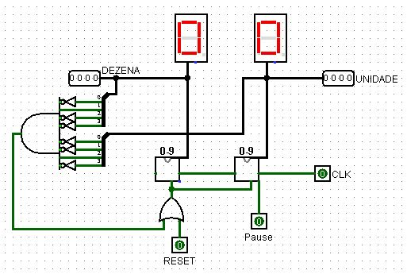

# Simulador de relógio
## Circuito Sequencial e Combinacional
Este projeto consiste em implementar o circuito de um relógio utilizando o simulador
logisim

## Especificações
- O relógio deve possuir CINCO botões: SELECT, PAUSE, MODE, ALTER e RESET.
    - O botão MODE serve para alternar entre os modos do relógio: NORMAL (N),
ALARME (A), MUDANÇA (C).
- Os LEDs C, A e N indicam o modo no qual o relógio se encontra, sendo eles MUDANÇA, ALARME e NORMAL, respectivamente.
   - No modo NORMAL o relógio apenas mostra as horas.
   - No modo ALARME é possível configurar o relógio para alarmar em uma determinada hora.
   - No modo MUDANÇA é possível modificar o horário do relógio.
- Nos modos MUDANÇA e ALARME, o botão SELECT pode ser utilizado para alternar entre os displays H, das horas, M, dos minutos e S, dos segundos Uma vez com um display selecionado, o botão ALTER pode ser utilizado para incrementar o valor do display.
- Os LEDs H, M e S indicam o display que está selecionado no momento, sendo eles hora, minuto e segundo, respectivamente.
- Quando o relógio marcar ou passar do horário que foi configurado no alarme, o LED ALARME deve acender.

## Subcircuitos
Fora o circuito principal foram criados 7 subcircuitos para auxiliar e facilitar o desenvolvimento do projeto

- 0-9: Conta de 0 até 9 e reseta

- 0-59: Conta de 0 até 59 e reseta

- 0-23: Conta de 0 até 23 e reseta

 
- Opção: Auxiliar na seleção de determinada opção

- Relogio padrão: Simular um relogio padrão e com todas as funcionalidades necessárias para as especificações ditas
    - Pausar
    - Resetar
    - Alterar horário do **relógio**
    - Clock para a simulação do tempo

- Alarme: Selecionar, alterar e resetar o horário do **alarme**

- D-E: Despetar o alarme e selecionar a saída que será usada para mostrar o horário do relógio **ou** do alarme que será exibido no display
    - No caso o relógio e o alarme estavam com 00:00:00, desta forma o alarme está ativo pois os horários são iguais

## Circuito principal

## Equipe: 
- Camila Vanessa de Matos Sousa
- Pedro Rafael Pereira de Oliveira
- Vinicius Inacio dos Santos
