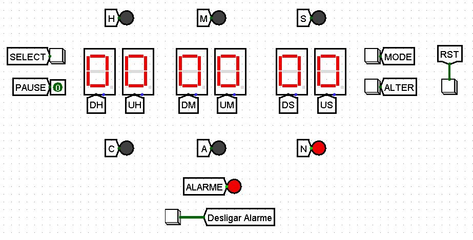

# Simulador de relógio
## Circuito Sequencial e Combinacional
Este projeto consiste em implementar o circuito de um relógio utilizando o simulador
logisim

## Especificações
- O relógio deve possuir CINCO botões: SELECT, PAUSE, MODE, ALTER e RESET.
    - O botão MODE serve para alternar entre os modos do relógio: NORMAL (N),
ALARME (A), MUDANÇA (C).
- Os LEDs C, A e N indicam o modo no qual o relógio se encontra, sendo eles MUDANÇA, ALARME e NORMAL, respectivamente.
   - No modo NORMAL o relógio apenas mostra as horas.
   - No modo ALARME é possível configurar o relógio para alarmar em uma determinada hora.
   - No modo MUDANÇA é possível modificar o horário do relógio.
- Nos modos MUDANÇA e ALARME, o botão SELECT pode ser utilizado para alternar entre os displays H, das horas, M, dos minutos e S, dos segundos Uma vez com um display selecionado, o botão ALTER pode ser utilizado para incrementar o valor do display.
- Os LEDs H, M e S indicam o display que está selecionado no momento, sendo eles hora, minuto e segundo, respectivamente.
- Quando o relógio marcar ou passar do horário que foi configurado no alarme, o LED ALARME deve acender.

## Subcircuitos
Fora o circuito principal foram criados 7 subcircuitos para auxiliar e facilitar o desenvolvimento do projeto

- 0-9: Conta de 0 até 9 e reseta
    - Para este circuito temos 3 entradas:
        - CLK: Vai diretamente como entrada do Clock no registrador, este faz com que o valor do registrador seja atualizado na entrada do registrador como D - Data.
            - Saída do registrador está sempre somando, com auxílio do somador e a constante, para que sempre a próxima vez que o clock for atualizado será em um número uma unidade maior.
        - Pause: A negação da mesma vai como entrada no Enable do registrador, em que, quando a entrada for 0, fará com que os gatilhos do clock não sejam efetivos.
        - RST: Passa por uma porta OR e quando ativo passa para o registrador na entrada Clear em que irá resetar o valor para 0.
            - Junto do RST na porta OR temos um AND usado para detectar o valor 10 (1010 em binário) em que foi utilizado um distribuidor para fazer a detecção do valor nos bits.
    - A saída Unidade possui 4 bits, é o valor que é proposto pelo circuito - contar de 0 até 9 
    - A saída NEXT, com apenas 1 bit (0 ou 1) será no usado no subcircuito a seguir.

- 0-59: Conta de 0 até 59 e reseta
    - São utilizados 2 subcircuitos de 0-9
    - As "mesmas" entradas do circuitos anterior são utilizadas aqui, pois é feito em base do anterior.
    - A saída NEXT do primeiro é a entrada do CLK do próximo, dessa forma, apenas quando o 1º resetar ele terá o encremento em uma unidade.
        - Por este motivo apenas o 1º precisa realmente possuir a entrada do Pause, já que se ele não avançar, estiver pausado, o circuito seguinte também não avancará.
    - A condição de reset para o 2º circuito, além da própria entrada RST, e utilizando o distribuidor da mesma forma que antes, é quando atinge o valor 6 na DEZENA, dando forma ao contador de 0 até 59 e novamente com a saída NEXT.

- 0-23: Conta de 0 até 23 e reseta

 
- Opção: Auxiliar na seleção de determinada opção

- Relogio padrão: Simular um relogio padrão e com todas as funcionalidades necessárias para as especificações ditas
    - Pausar
    - Resetar
    - Alterar horário do **relógio**
    - Clock para a simulação do tempo

- Alarme: Selecionar, alterar e resetar o horário do **alarme**

- D-E: Despetar o alarme e selecionar a saída que será usada para mostrar o horário do relógio **ou** do alarme que será exibido no display
    - No caso o relógio e o alarme estavam com 00:00:00, desta forma o alarme está ativo pois os horários são iguais

## Circuito principal

